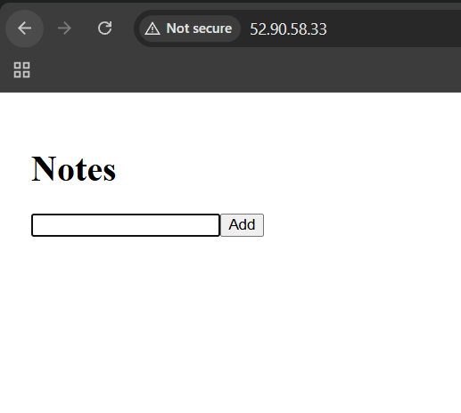

# Notes App - Deployment Guide

This project includes a backend (Node.js + Express) and a frontend (React), both dockerized and deployed using Docker Compose.

---

## Requirements

- A Linux VM (I used ubuntu)
- Docker installed
- Docker Compose installed
- Ports 80 (frontend) and 5000 (backend) open on the VM firewall/security group

---

## How to Run the App on Your VM

1. SSH into your VM.

2. Clone this repository or copy the project files to the VM.

3. Navigate to the project root folder (where `docker-compose.yml` is located).

4. Run the following command to build and start both backend and frontend containers:

   ```cmd
   docker-compose up --build -d
   ```

## Screenshots

### Notes app running in browser



### Docker containers running on VM


### CI/CD Pipeline

## Overview

This GitHub Actions workflow automates the build, test, and deployment process for the frontend and backend apps on every push to the main branch.

CI:

Checks out code

Installs dependencies (npm ci)

Builds the apps (npm run build)

Builds and pushes Docker images to Docker Hub

CD:

Connects to your VM via SSH

Pulls the latest Docker images

Runs containers with docker compose up -d --remove-orphans

## Triggers

Runs automatically on every push to the main branch.

## Prerequisites

Docker and Docker Compose installed on your VM

Proper docker-compose.yml file on your VM

GitHub secrets set:

DOCKER_USERNAME

DOCKER_PASSWORD (or access token)

VM_HOST

VM_USER

VM_SSH_KEY (private SSH key)

## How to Use

Push changes to the main branch.

Monitor the workflow in the Actions tab on GitHub.

After completion, your VM will run the updated containers.
